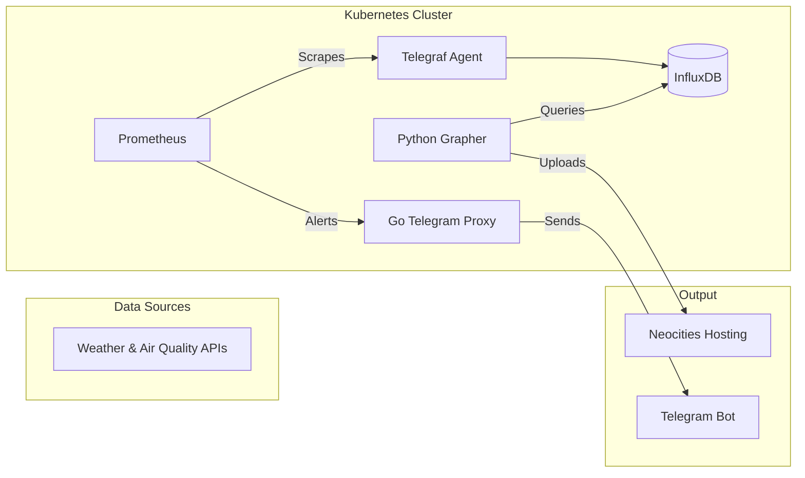

# Weather & Pollution Monitoring System

A cloud-native monitoring solution that collects meteorological data, generates visual trends, and provides automated alerting.

## 🌟 Overview

This project implements an end-to-end data pipeline:
1.  **Ingestion:** [Telegraf](https://www.influxdata.com/time-series-platform/telegraf/) collects weather and air quality data from open APIs.
2.  **Storage:** Time-series data is stored in **InfluxDB**.
3.  **Visualization:** A custom **Python** application generates high-quality trend graphs and synchronizes them to a static web host.
4.  **Observability:** **Prometheus** monitors system health and metric thresholds.
5.  **Alerting:** A **Go-based Telegram Proxy** translates Alertmanager webhooks into instant messenger notifications.

---

## 🏗 System Architecture



---

## 📦 Core Components

### 📈 Weather Grapher (`/app`)
A Python service that automates data visualization.
- **Engine:** `matplotlib` & `seaborn` for professional-grade aesthetics.
- **Process:** Fetches temperature, pressure, humidity, and PM2.5 data.
- **Delivery:** Generates 2-day and 2-week rolling windows and pushes them to **Neocities** via API.

### 🤖 Telegram Proxy (`/telegram-proxy`)
A lightweight Go microservice acting as an Alertmanager-to-Telegram bridge.
- Translates Prometheus alerting payloads into human-readable messages.
- Supports `firing` and `resolved` statuses with custom formatting.

### 🌐 Infrastructure & DevOps
- **Helm Charts:** Standardized deployment templates for all services.
- **Makefile:** Unified command-line interface for the entire lifecycle.
- **Telegraf Config:** Specialized input plugins for meteorological data.

---

## 🚀 Deployment

### Prerequisites
- A Kubernetes cluster with `kubectl` and `helm` configured.
- InfluxDB instance (local or remote).
- API tokens for Neocities and a Telegram Bot.

### Setup Steps

1.  **Manage Secrets:**
    Populate `.secrets/secrets.env` and `.secrets/secrets-telegram.env`, then run:
    ```bash
    make secrets
    ```

2.  **Build & Ship Images:**
    ```bash
    make push
    make push-proxy
    ```

3.  **Deploy Applications:**
    ```bash
    make deploy-all
    ```

4.  **Enable Monitoring:**
    ```bash
    make deploy-monitoring
    ```

---

## 🛠 Management CLI (Makefile)

- `make build-all`: Build all Docker images.
- `make deploy-local`: Quick deployment with development tags.
- `make logs`: Stream logs from the weather application.
- `make sync-config`: Update the `index.html` frontend via ConfigMap.
- `make undeploy`: Clean up all resources from the cluster.

---

## 📋 Roadmap
- [x] Implement `plt.close()` in Python to prevent memory leaks.
- [ ] Add basic authentication to the Telegram Proxy endpoint.
- [ ] Optimize the Docker image size for the Go proxy.
- [ ] Integrate Grafana for real-time interactive dashboards.
